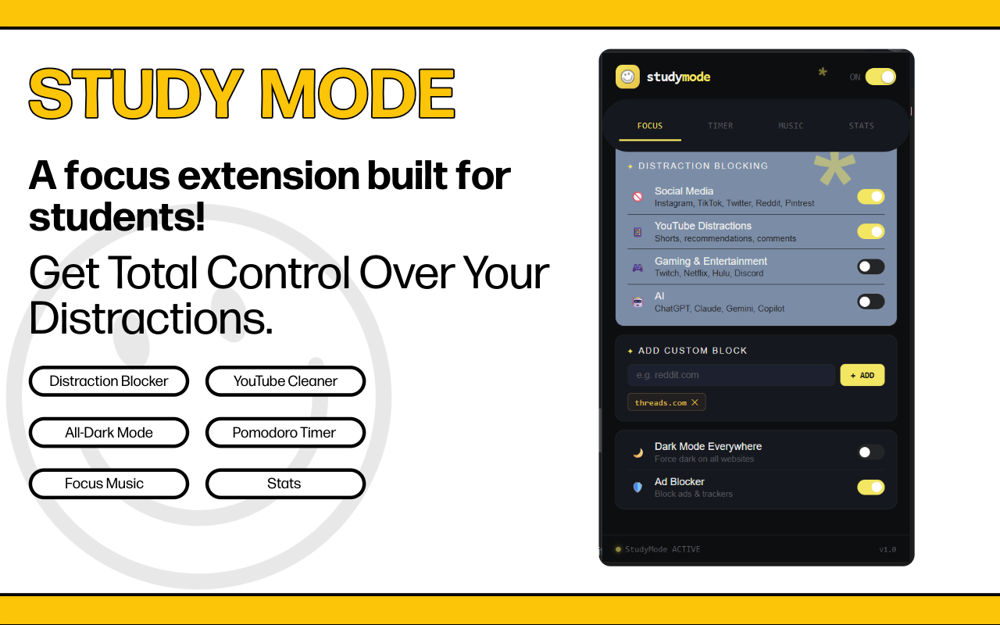
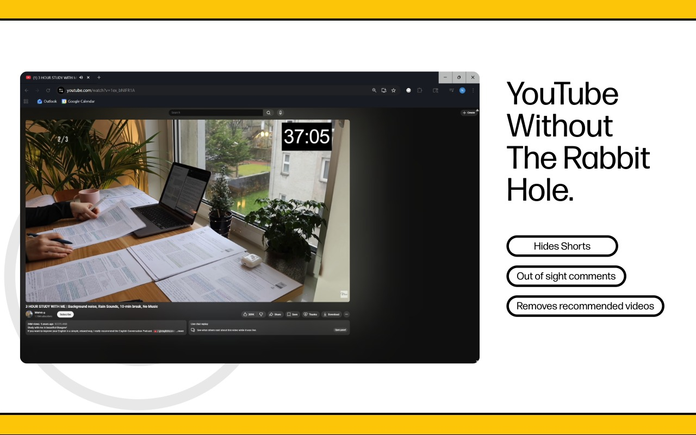
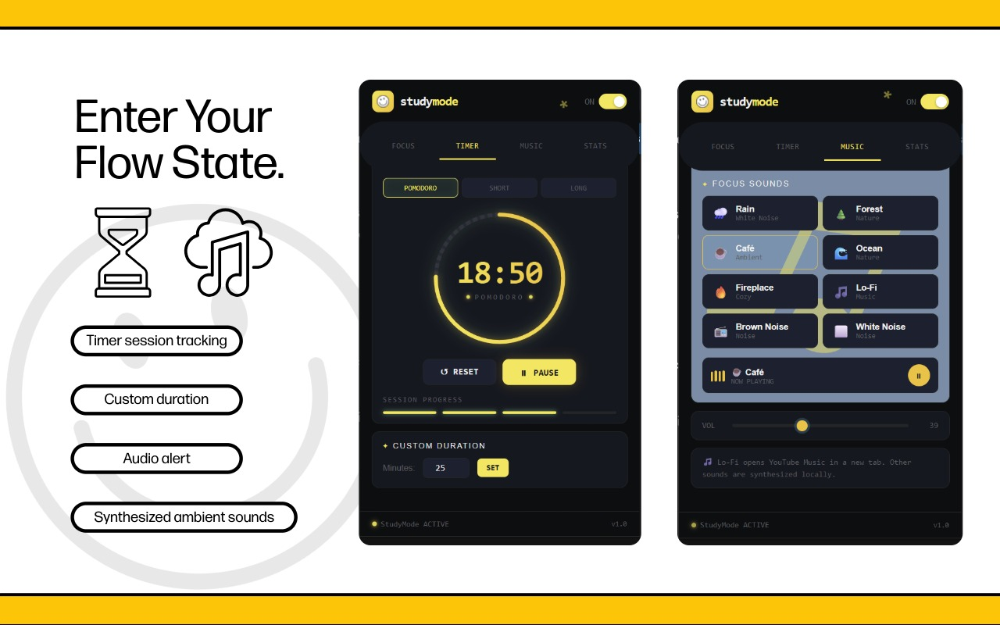
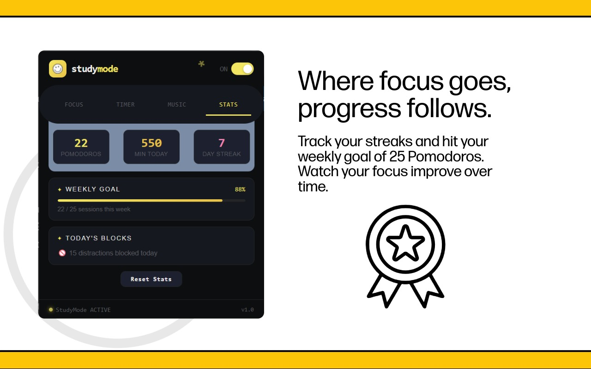
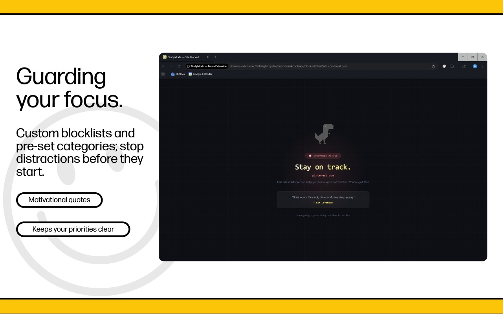

# StudyMode Chrome Extension

A feature-rich focus extension built for students.

## Features

- **Distraction Blocker** — Blocks social media (Instagram, TikTok, Twitter, Reddit, Facebook, SnapChat, Pinterest), gaming sites (Twitch, Netflix, Hulu, Discord), AI chat bots (ChatGPT, Claude, Gemini, Copilot), and custom sites you add
- **YouTube Cleaner** — Hides Shorts, recommended videos, comments, and end cards so you can watch study content without falling down a rabbit hole
- **Dark Mode Everywhere** — Forces dark mode on any website
- **Ad Blocker** — Blocks 25+ major ad networks and trackers via declarativeNetRequest
- **Pomodoro Timer** — 25/5/15 minute modes + custom duration, with session tracking and notifications
- **Focus Music** — 8 synthesized ambient sounds (rain, forest, café, ocean, fire, brown noise, white noise, lo-fi link)
- **Stats** — Track pomodoros completed, minutes studied, and weekly progress!

## How to Use

1. Click the extension icon in your toolbar
2. Toggle **StudyMode ON** using the switch in the top right
3. Configure which features to enable in the **Focus** tab
4. Start a study session using the **Timer** tab
5. Play ambient sounds from the **Music** tab
6. Track your progress in the **Stats** tab

## Tips

- StudyMode must be **ON** for blocking and dark mode to activate
- YouTube Cleaner works on any YouTube tab — refresh after enabling
- Custom site blocks persist across sessions
- The Pomodoro timer sends a browser notification when your session ends
- Click a sound again to stop it; adjust volume with the slider

## Extension Demo 
<details>
<summary>Click to view screenshots</summary>







</details>

## File Structure

```
studymode-chrome-extension/
├── manifest.json          # Extension config (MV3)
├── popup.html             # Main UI
├── popup.js               # UI logic, timer, music engine
├── background.js          # Service worker, blocking logic
├── content.js             # Injected into all pages
├── content.css            # Content styles
├── blocked.html           # Shown when a site is blocked
├── rules/
│   ├── ad_block_rules.json    # declarativeNetRequest ad rules
│   └── site_block_rules.json  # (placeholder)
└── images/
    ├── icon16.png
    ├── icon48.png
    ├── icon128.png
    └──The_Lonely_T_Rex.png
```
